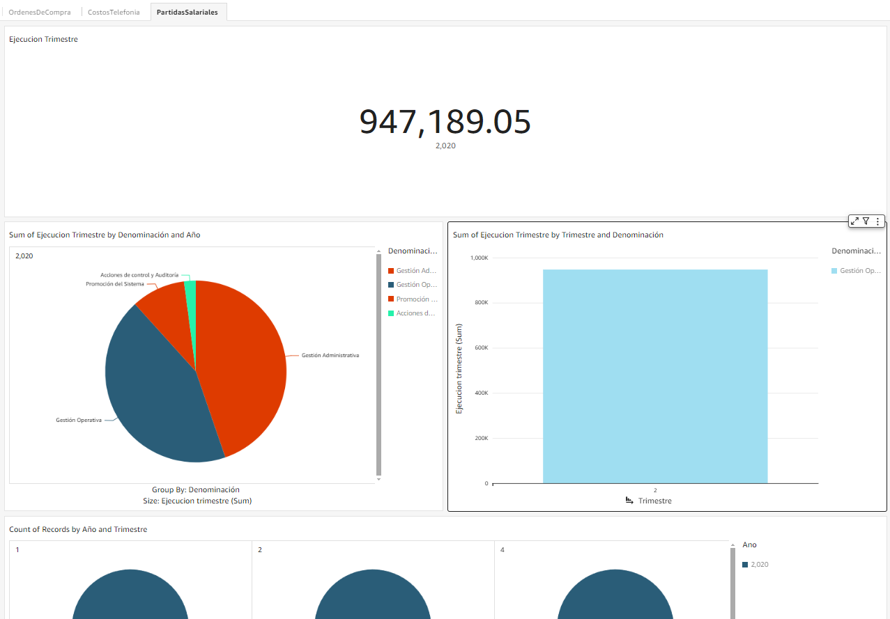
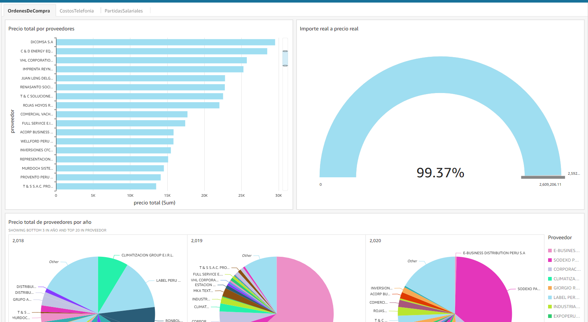
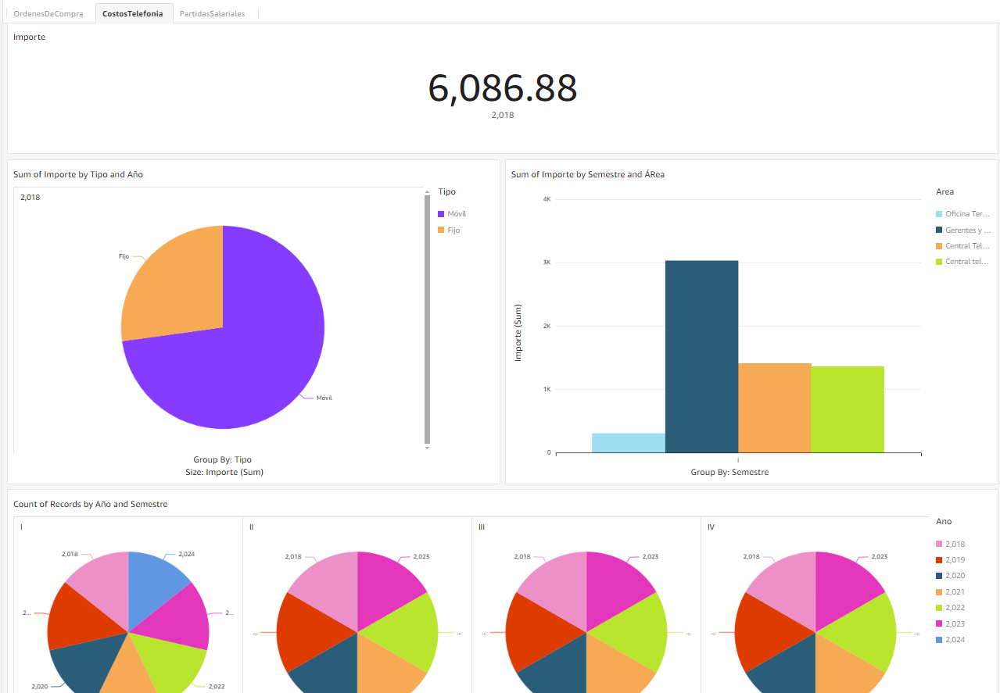

# Proyecto Unidad 3

## Generacion de almacen de datos y reportes con prediccion de datos.

#### Estudiantes:

| Nombre y Apellido                | Código     |
| -------------------------------- | ---------- |
| Cano Sucso, Anthony Alexander    | 2020067573 |
| Chambilla Zuñiga, Josue Abraham  | 2020067575 |
| Jarro Jachi, Jose Luis           | 2020067148 |
| Rivera Mendoza, Jhonny           | 2020067144 |
| Valverde Zamora, Jean Pier Elias | 2020066920 |

### Diagrama de arquitectura:

### Diagrama Despliegue

### Dashboard de la métrica de Partidas salariales:

### Dashboard de la métrica de Ordenes:

### Dashboard de la métrica de Costos de Telefonía:

